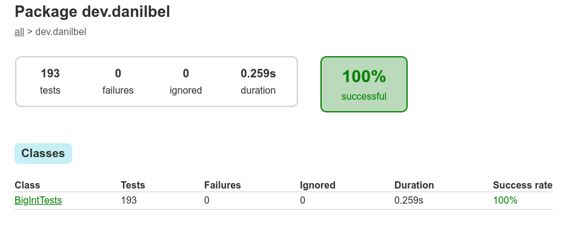
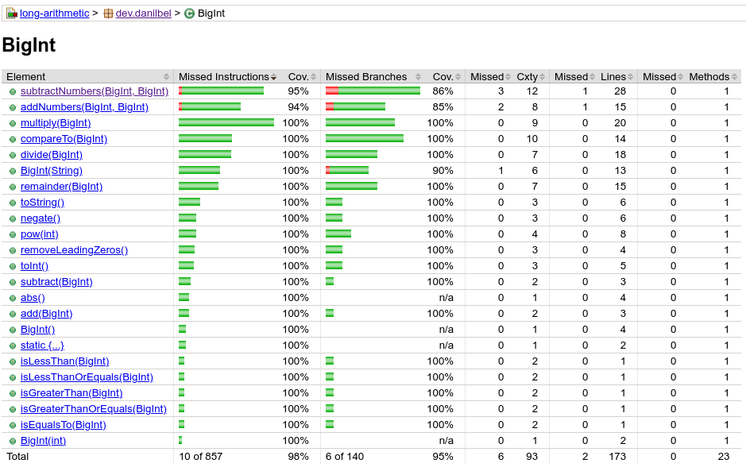

# Long Arithmetic

This is a realization of the solution to the [task Long Arithmetic](TASK.md).

> Approximate lead time: 4 hours

### Requirements
* Java 17

### How to run unit tests

The first step is to clone the repository
```bash
git clone https://github.com/Danilbel/long-arithmetic-test-task.git
```

Then go to the project folder
```bash
cd long-arithmetic-test-task
```

The tests then need to be run
```bash
./gradlew clean test
```
Tests report will be generated in the `build/reports/tests/test/index.html` file. \
And the program's test coverage report will be generated in the `build/reports/tests/jacoco/test/html/index.html` file.

### How to view test results and coverage

To view the test results and coverage, open the `index.html` file in your browser.

**Test results**: `build/reports/tests/test/index.html`



**Test coverage**: `build/reports/tests/jacoco/test/html/index.html`



